<!--

author:   Britta Petersen
email:    fdm@rz.uni-kiel.de
version:  0.1.0
language: en
narrator: UK English Female

icon:     images\cau-norm-en-lilagrey-rgb.png

logo:     https://git-scm.com/images/branching-illustration@2x.png

link: https://raw.githubusercontent.com/RDM4CAU/Intro-to-RDM/refs/heads/main/cau-style.css

comment:  Presentation Workshop "Introduction to Research Data Management" for PhDs of GRK DIVERSILLIANCE

script:   https://cdn.jsdelivr.net/npm/mermaid@9.1.1/dist/mermaid.min.js

@mermaid
<script run-once="true" modify="false">
mermaid.initialize({});

var svg = mermaid.render('io9wuwzxt',`@0`.replace(/\\n/g, "\n"),
function(g) {
    return true;
})

"HTML: " + svg
</script>
@end

script:   https://s.plantuml.com/synchro2.min.js

@plantUML : @plantUML.exec(svg,```@0```)

@plantUML.svg: @plantUML.exec(svg,```@0```)

@plantUML.png: @plantUML.exec(png,```@0```)

@plantUML.exec
<script run-once modify="false">
function draw(type, code, counter = 10) {
  try {
    let s = unescape(encodeURIComponent(code));
    var arr = [];
    for (let i = 0; i < s.length; i++) {
      arr.push(s.charCodeAt(i));
    }
    let compressor = new Zopfli.RawDeflate(arr);
    let compressed = compressor.compress();
    let dest = "https://www.plantuml.com/plantuml/" + type + "/" + encode64_(compressed);
    send.html("")
    send.stop()
  } catch(e) {
    if (counter > 0) {
      setTimeout(draw(type, code, counter - 1), 100)
    } else {
      send.stop()
    }
  }
}

draw("@0", `@1`)
</script>

<span>

</span>
@end

@plantUML.eval
<script>
function draw(type, code, counter = 10) {
  try {
    let s = unescape(encodeURIComponent(code));
    var arr = [];
    for (let i = 0; i < s.length; i++) {
      arr.push(s.charCodeAt(i));
    }
    let compressor = new Zopfli.RawDeflate(arr);
    let compressed = compressor.compress();
    let dest = "https://www.plantuml.com/plantuml/" + type + "/" + encode64_(compressed);
    console.html("")
    console.log(dest)
    send.lia("LIA: stop")
  } catch(e) {
    if (counter > 0) {
      setTimeout(draw(type, code, counter - 1), 50)
    } else {
      send.lia("LIA: stop")
    }
  }
}

draw("@0", `@input`)
""
</script>
@end

-->

# Introduction to RDM

<script input="button">
alert("Disclaimer: Please note that you are leaving the CAU net once you open this presentation in your browser. This presentation includes links to other third party websites and services. These sites are not under our control. RDM@CAU is not responsible for the content of linked third party websites. Please be aware that the security and privacy policies on these sites may be different than CAU policies. Please read third party privacy and security policies closely.")

"Disclaimer"
</script>

>**Britta Petersen**
>
>Central Research Data Management of Kiel University
>
> To see this document as an interactive LiaScript rendered version, click on the
> following link/badge:
>
> [](https://liascript.github.io/course/?https://raw.githubusercontent.com/RDM4CAU/Intro-RDM_DIVERSILLIANCE/refs/heads/main/IntroRDM_presentation.md)
>
> If you need help, feel free to ask us any questions:
>
> [fdm@rz.uni-kiel.de](mailto:fdm@rz.uni-kiel.de)
>
> ____________________________________________
>
>  This work is licensed under a [Creative Commons Attribution 4.0 International License](https://creativecommons.org/) with exception of the used material from other copyright holders.

<div style="page-break-after: always;"></div>

## Please be nice!

Some rules for today:

<div style="float:left; width:60%;">
  <p>

* Please mute your microphone when you do not have the floor

* Please hear each other out and let each other finish

* Draw attention to yourselves when you want to say something

* Please help each other

* Please do not do anything on the side

* Please ask if you have not understood something

* Please contribute actively

* Please allow mistakes -> positive culture of mistakes.

</p>


</div>

<div style="float:right; width:40%;">
  
    <sub style="text-align: right;">Source: Pixabay</sub>
</div>

<div style="page-break-after: always;"></div>

## Goals today
At the end of the workshop you should…

<div style="float:left; width:60%;">
  <p>

- have a basic idea of the general concept of RDM and know some important related terms and principles.

- can identify and assess data types and formats.

- can recall some rules in regard of naming files and folders.

- can explain the importance of documentation and can describe what metadata are.

- can describe what a DMP is.

- **have started to scratch out a DMP for your project.**

- know RDM related CAU contacts.

- had some time to exchange with peers.

- hopefully also had some fun!

</p>

</div>

<div style="float:right; width:30%;">
  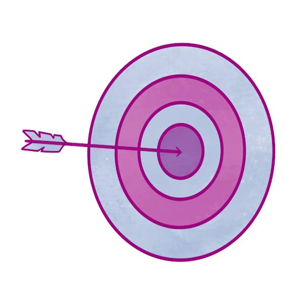
  <sub><span style="text-align: right;">Source: Cleo Michelsen</span></sub>
</div>

<div style="page-break-after: always;"></div>

## Agenda

Let us have a look at our workload for today:

<div style="float:left; width:60%;">
  <p>

- Research data and research data management
- Research data lifecycle & FAIR principles
- Data types and formats
- Data organisation

  ***LUNCH BREAK***

- Documentation and metadata
- Storage & Back Up
- Licenses
- Data publication
- **Data management plan (DMP)**

</p>

</div>

<div style="float:right; width:30%;">
  
  <sub><span style="text-align: right;">Source: Pixabay</span></sub>
</div>

<div style="page-break-after: always;"></div>

## Warm up!

<!--
style="width: 20%; max-width: 800px; float:right"
title="puzzle"
onclick="alert('Let´s play!');"
-->

>**Let us play a game…**
>
>Hide your camera (use a sticker or your finger).
>
>I will read statements to you.
>
>Each time you can agree with the statement show yourself and wave.
>
>That's it !

{{1-2}}
********************************************************************************

><p style="color:#9a047f">I like to drink coffee in the morning.</p>

********************************************************************************

{{2-3}}
********************************************************************************

><p style="color:#9a047f">My academic background is in  agricultural sciences.</p>

********************************************************************************

{{3-4}}
********************************************************************************

><p style="color:#9a047f">If I have to decide to go to the cinema or to a concert, I decide for the concert.</p>

********************************************************************************

{{4-5}}
********************************************************************************

><p style="color:#9a047f">My academic background is in  economics.</p>

********************************************************************************

{{5-6}}
********************************************************************************

><p style="color:#9a047f">I know the FAIR data principles.</p>

********************************************************************************

{{6-7}}
********************************************************************************

><p style="color:#9a047f">My academic background is in  social sciences.</p>

********************************************************************************

{{7-8}}
********************************************************************************

><p style="color:#9a047f">I have an ORCID.</p>

********************************************************************************

{{8-9}}
********************************************************************************

><p style="color:#9a047f">My academic background is in  nutritional sciences.</p>

********************************************************************************

{{9-10}}
********************************************************************************

><p style="color:#9a047f">I am using open data for my research work.</p>

********************************************************************************

{{10-11}}
********************************************************************************

><p style="color:#9a047f">I am working with personal data.</p>

********************************************************************************

{{11-12}}
********************************************************************************

><p style="color:#9a047f">My academic background has not yet been mentioned.</p>

********************************************************************************

{{12-13}}
********************************************************************************

><p style="color:#9a047f">I am writing code for my PhD.</p>

********************************************************************************

{{13-14}}
********************************************************************************

><p style="color:#9a047f">I was sent to this workshop by my supervisor and really don't know what am I supposed to do here.</p>

********************************************************************************

<div style="page-break-after: always;"></div>

# Research data management

>__Let's get started!__
>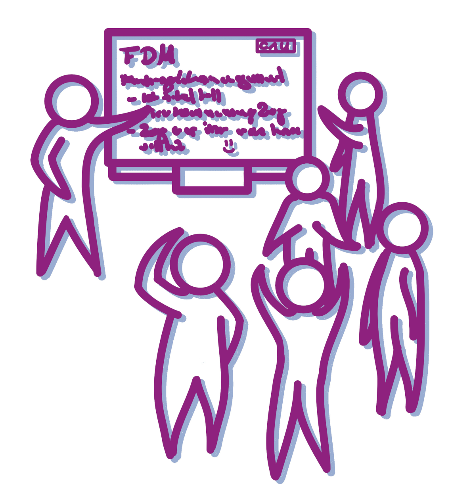<!--
style="width: 20%; max-width: 800px; float:right"
title="working"
onclick="alert('working');"
-->
>**What are we talking about today?**

## Definition

{{0-3}}
****************

What is research data management?
---
****************

{{1-3}}
****************
> ‘Research data management is an explicit process covering the creation and stewardship of research materials to enable their use for as long as they retain value.’
>
>[DCC Glossary](https://www.dcc.ac.uk/about/digital-curation/glossary#R)

****************

{{2-3}}
****************
> ‘Research data management (RDM) [has] the common goal of making research data
>
>- accessible,
>- reusable and
>- verifiable
>
>in the long term and independent of particular people.’
>
>[forschungsdaten.info](https://forschungsdaten.info/)

******************

## Why we should take care

{{0}}
****************

><big>Movie time! 📽️😀</big>
>
>---
>__Let's discuss!__
>
>Research data management is a lot of work! Why should we do do it?
****************

---

<iframe width="100%" height="50%" src="https://www.youtube.com/embed/66oNv_DJuPc
" title="YouTube video player" frameborder="0" allow="accelerometer; autoplay; clipboard-write; encrypted-media; gyroscope; picture-in-picture; web-share" allowfullscreen></iframe>

<div style="page-break-after: always;"></div>

## Research Data

{{0-1}}
********************************************************************************

><big>**So what is research data?**</big>
><!--
style="width: 20%; max-width: 800px; float:right" -->
>
>**What do you think**: What is research data? Collect as many examples for research data as you can think of.
>
>https://answergarden.ch/5229251
---

********************************************************************************

{{1-2}}
********************************************************************************

<iframe src="https://answergarden.ch/5229251" style="border:0px;width:100%;height:500px" allowfullscreen="true" webkitallowfullscreen="true" mozallowfullscreen="true"></iframe>

********************************************************************************

<div style="page-break-after: always;"></div>

{{2-5}}
**********
What is research data?
---

> _‘In short data means whatever is necessary to validate or reproduce your research findings, or to gain a richer understanding of them.’_
>
>[University of Edinburgh Research Data Service](https://www.ed.ac.uk/information-services/research-support/research-data-service/research-data-management)

**********

{{3-5}}
***********
> _‘Any information you use in your research.’_
>
>[University of Camebridge PrePARe Project](https://www.repository.cam.ac.uk/handle/1810/243750)

************

{{4-5}}
***************
> _‘The term “research data” generally refers to all kinds of (digital) data that represent the result of scientific work or that serve as a basis for such work. Research data is generated using a wide variety of methods, such as measurements, source research or surveys. Therefore, it is always subject- and project-specific.’_
>
>[Uni Giessen](https://www.uni-giessen.de/ub/en/resteach/researchdata#anchor_what-is-research-data)

**************

<div style="page-break-after: always;"></div>

{{5-6}}
***************
Examples for research data
---

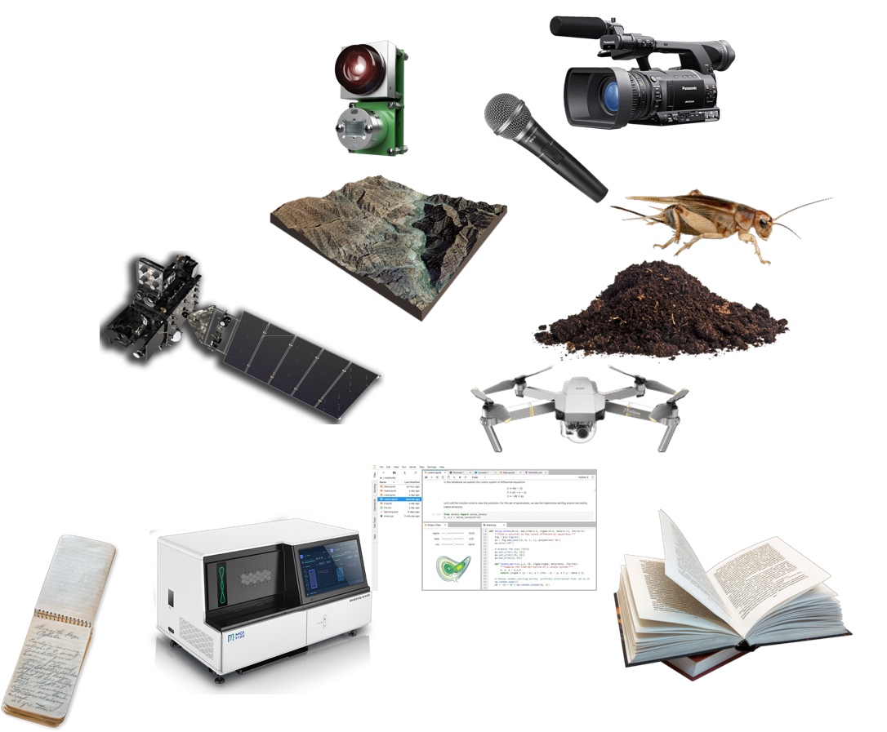 <!-- width="450px" align="right" -->

- Survey responses
- Interview and focus-group transcripts
- Audio and video recordings
- Field notes and observation records
- Laboratory measurements
- Sensor readings
- Images and scans
- Clinical and administrative records
- Statistical data files
- Computer code and analysis scripts
- Simulation inputs and outputs
- Algorithms and trained models
- Geographic and remote-sensing data
- Genetic or protein sequences
- Laboratory and field notebooks
- Archival photographs and document transcriptions
- Text corpora
- Annotated bibliographies
- Creative works analysed or produced through practice-based research
- Documentation, codebooks, data dictionaries, and README files

***************


{{6}}
***************

>**It makes sense to consider which of the pieces of information you use as a researcher should actually be described as research data!**

>-> A publication used only as background reading is not normally research data. However, publications can become research data when they are systematically collected, coded, compared, annotated, or analysed. For example, 500 news articles used in a content analysis constitute research data, while five articles cited only to support an argument usually do not.
>
>-> Similarly, computer code may be research  data, a research method, or a research output. Its role depends on whether it is needed to generate, process, analyse, reproduce, or interpret the findings.
>
><small>[Hassan, M. (2026, June 28). Research Data – Definition, Types, Examples and Best Practices.](https://researchmethod.net/research-data/)</small>

***********

<div style="page-break-after: always;"></div>

### Categories of research data

{{0-1}}
*******************

<!-- width="80%" -->
``` ascii
                       **RESEARCH DATA CATEGORIES**
                                   │
       ┌───────────────────────────┼───────────────────────────┐
       │                           │                           │
       │                           │                           │
   📚 SOURCE                    📄 FORM               🧪 GENERATION METHOD
       │                           │                           │
   Primary                     Structured                Observational     
   Secondary                 Semi-structured              Experimental
   Reused                     Unstructured                 Simulation
       │                           │                        Derived
       │                           │                           │
       │                           │                           │
       ├───────────────────────────┼───────────────────────────┤
       │                           │                           │
       │                           │                           │
   ⚙️ PROCESSING STAGE       📊 APPROACH             🔓 SENSITIVITY/OPENNESS
       │                           │                           │
       │                           │                           │
      Raw                    Quantitative                    Open
   Processed                 Qualitative                   Restricted
                             Mixed Methods                   Closed


```

*******************

{{1-2}}
*******************
Classification by Source 📚
---

| Data type | Description | Examples |
| --------- | ----------- | -------- |
| Primary data | Newly collected or generated data directly for the current research project | Experimental measurements, clinical trials, survey responses, photographs from fieldworks |
| Secondary data | Already existing data reused for a new research purpose | Published datasets |

*****************


{{2-3}}
*******************
Classification by Form 📄
---

| Data type | Description | Examples |
| --------- | ----------- | -------- |
| Structured data | Data organized according to a predefined schema, such as rows and columns | relational databases, spreadsheets and CSV files |
| Unstructured data | Data without a predefined schema that usually requires additional processing before systematic analysis. | Interview transcripts, field notes, images, videos, PDF documents |
| Semi-structured data | Data with organizational markers or a consistent hierarchy, but without a rigid fixed schema. | JSON, XML, electronic health records |

*****************

{{3-4}}
*******************
Classification by Generation Method 🧪
---

| Data type | Description | Examples |
| --------- | ----------- | -------- |
| Observational data | Data collected by observing a phenomenon as it naturally occurs, without manipulating variables. | Field observation, astronomical images, sensor data |
| Experimental data | Data generated under controlled conditions in which the researcher deliberately manipulates one or more variables. | Laboratory measurements, randomized controlled trials, psychology experiments |
| Simulation data | Data generated by computational models rather than directly measured from the physical or social world. | Climate models, molecular dynamics, economic simulations |
| Derived or compiled data | Data produced by transforming, aggregating, or analyzing other data. | Statistical summaries, text-mining corpus |

*******************

{{4-5}}
*******************

Classification by Processing Stage ⚙️
---

| Data type | Description | Examples |
| --------- | ----------- | -------- |
| Raw data | Direct, unmodified output from a data collection instrument or process. | Sensor readings, unedited survey exports, sequencing output |
| Processed data | Data that has undergone cleaning, filtering, normalization, or other transformations. | Cleaned datasets, analysis-ready files |
| Derived data | Data calculated or generated from other data | A geocoded location derived from an address |
| Analysed data | Results produced through statistical, computational, qualitative, or visual analysis. | Regression output, coded qualitative themes, tables and graphs, trained model results |

*******************

{{5-6}}
*******************
Classification by Approach 📐
---

| Data type | Description | Examples |
| --------- | ----------- | -------- |
| Quantitative data | Numerical measurements or counts that support statistical analysis. | Laboratory measurements, survey responses, instrument readings |
| Qualitative data | Non-numerical content typically analyzed through coding, thematic analysis, or interpretation. | Text, images, audio, video |
| Mixed-methods data | Data combining quantitative and qualitative components within a single study design. | Survey data combined with interview data |

*******************

{{6-7}}
*******************

Classification by Sensitivity/Openness 🔓
---

| Data type | Description | Examples |
| --------- | ----------- | -------- |
| Open data | Data that can be shared without restriction, subject to applicable licensing and anonymization requirements. | Anonymized datasets released under an open license |
| Restricted or controlled-access data | Data that can be shared only under specified conditions or with approved access. | Identifiable research data, commercially sensitive data |
| Confidential or closed data | Data that cannot be shared because of legal, ethical, contractual, or security restrictions. | Highly sensitive personal or security-related data |


*************

{{7}}
*******************
> [!IMPORTANT] Research data can be classified in several ways.
>
> Classifications can overlap and a single dataset can belong to several categories simultaneously!

---

Example:
---

<!-- width="60%" -->
``` ascii
Interview transcripts
│
├── 📚 Source:          Primary
├── 📄 Form:            Unstructured
├── 🧪 Generation:      Observational
├── ⚙️ Processing:      Processed
├── 📊 Approach:        Qualitative
└── 🔓 Sensitivity:     Restricted
```

<small>Source: Adapted from [CASRAI Editorial Board (2026), Types of Research Data: A Taxonomy for Data Management Planning, licensed under CC BY 4.0.](https://casrai.org/guides/types-of-research-data) and [Hassan, M. (2026, June 28). Research Data – Definition, Types, Examples and Best Practices. Research Method.](https://researchmethod.net/research-data/)</small>

*******************

### Define your research data

 <!-- width="300px" align="right" -->

Individual/Pair Work
---
**Think about your own PhD project.**

1. What types of research data do you work with?

2. Can you categorize them along the different classifications?

3. Are there any data that are difficult to classify? Why?

# Research data lifecycle

<center>
{{0-1}}
************

 <!-- width="600px" -->

************
</center>

<div style="page-break-after: always;"></div>

{{1-2}}
************

> [!IMPORTANT] **1. Planning**
>**Start planning your data handling before collection.**
>
>* How do you plan to create data?
>* Will data be reused? How is the data available?
>* Which data types, in terms of data formats (e.g. image data, text data or measurement data in tables) are created?
>* What volume of data can be expected?
>* What legal and ethical aspects need to be taken into account?
>* Who is responsible (for what)?
>* Which analyses are planned? What requirements must the data meet in order to be analysed as planned? What kind of software environment will you need?
>* How and where will the data be stored during the project?
>* What is your back up strategy?
>* How will the security of sensitive data be guaranteed during the project (access and usage management)?


************

{{2-3}}
************
> [!IMPORTANT] **2. Collect or generate**
> **Use consistent procedures, tested instruments and documented protocols. Record contextual information while it is still known.**
>
>* Which (digital) methods and tools (e.g. software) are required collect and safe the (raw) data?
>* What measures are taken to ensure high quality of the data?
>* What approaches are taken to document your work in a comprehensible manner?

************

{{3-4}}
************
> [!IMPORTANT] **3. Process, clean & analyse**
>**Transcribe, validate, correct, code, anonymise, convert, or combine the data. Keep raw data preserved and document every substantive transformation.**
>
> **Use appropriate statistical, computational, qualitative, visual, or mixed-methods procedures. Retain the scripts, coding decisions, parameters and software information needed to understand the analysis.**

************


{{4-5}}
************
> [!IMPORTANT] **4. Archiving**
> **Know the obligations and chose your archiv solution accordingly.**
>
>* Are there any obligations regarding archiving your data?
>* Do you plan to archive your data in a suitable infrastructure?
>* Are there any important scientific codes or professional standards that should be taken into account?

************

{{5-6}}
************
> [!IMPORTANT] **5. Publication**
> Determine what can be shared, with whom, under what licence, at what time, and through which repository. Sensitive data may require mediated or controlled access.
>
>* What legal conditions need to be considered?
>* What ethical conditions need to be considered?
>* Are there any restrictions to be expected with regard to publication or accessibility of the data?
>* How are usage and copyright aspects as well as ownership issues taken into account?
>* Are there any important scientific codes or professional standards to be taken into account?

************

{{6}}
************
> [!IMPORTANT]**6. Re-use**
>** Retain valuable data and documentation in sustainable formats and repositories. When data must be destroyed, use an approved and documented disposal method.**
>
>* Which data is particularly suitable for re-use?
>* What criteria are used to select research data in order to make it available for re-use by others?
>* Are there embargo periods?
>* When can the research data expected to be used by third parties?


************

## Your research data lifecycle

 <!-- width="300px" align="right" -->

Individual work:
---

Think about your own PhD project. Try to take notes describing what steps and procedures at each station of the research data lifecycle are relevant to your research data.

-> Does this research data lifecycle fit to your research project?

-> Are there any deviations? If yes, please take notes on deviations.

<div style="page-break-after: always;"></div>

# FAIR Data Principles

{{0-1}}
****************

<div style="width:50%;">
  
  <sub><span style="text-align: right;">Illustration: Patrick Hochstenbach in Engelhardt, Claudia et. al. (2021)</span></sub>
</div>

****************

{{1-2}}
> An important guiding principle in research data management is to keep data 
>
>🔍 **F**indable,
>
>🔐 **A**ccessible,
>
>🔗 **I**nteroperable and
>
>♻️ **R**eusable
>
>in the ~~long term~~ and ~~independent of individuals~~.


<div style="page-break-after: always;"></div>

{{2}}
>**F**indable

{{3-4}}
****************
The first step in (re)using data is to find them. Metadata and data should be easy to find for both humans and computers. Machine-readable metadata are essential for automatic discovery of datasets and services, so this is an essential component of the FAIRification process.

F1. (Meta)data are assigned a globally unique and persistent identifier

F2. Data are described with rich metadata (defined by R1 below)

F3. Metadata clearly and explicitly include the identifier of the data they describe

F4. (Meta)data are registered or indexed in a searchable resource

***************

{{2}}
>**A**ccessible

{{4-5}}
***********************
Once the user finds the required data, the user needs to know how data can be accessed, including authentication and authorisation.

A1. (Meta)data are retrievable by their identifier using a standardised communications protocol

A1.1 The protocol is open, free, and universally implementable

A1.2 The protocol allows for an authentication and authorisation procedure, where necessary

A2. Metadata are accessible, even when the data are no longer available

******************

{{2}}
>**I**nteroperable

{{5-6}}
**********************
The data usually needs to be integrated with other data. In addition, the data needs to interoperate with applications or workflows for analysis, storage, and processing.

I1. (Meta)data use a formal, accessible, shared, and broadly applicable language for knowledge representation.

I2. (Meta)data use vocabularies that follow FAIR principles

I3. (Meta)data include qualified references to other (meta)data

**********************

{{2}}
>**R**eusable

{{6-7}}
***************
The ultimate goal of FAIR is to optimise the reuse of data. To achieve this, metadata and data should be well-described so that they can be understood, replicated and/or combined in different settings.

R1. Meta(data) are richly described with a plurality of accurate and relevant attributes

R1.1. (Meta)data are released with a clear and accessible data usage license

R1.2. (Meta)data are associated with detailed provenance

R1.3. (Meta)data meet domain-relevant community standards

**************


{{8}}
***************
> [!NOTE] Try to bear the FAIR principles in mind when handling your data!
>
>FAIR does **not** mean that every dataset must be openly downloadable. Restricted data can still be FAIR when its metadata is findable and the conditions for legitimate access are clearly described (Wilkinson et al., 2016).
>
>A useful principle is:
>
>Make data as open as possible and as restricted as necessary.

**************

<div style="page-break-after: always;"></div>


# Data organisation
{{0-1}}
****************

<div style="text-align:center">
><p style="color:#9a047f">**It may seem trivial, but structured folder and file naming is a first step in research data management!**</p>
</div>

<center>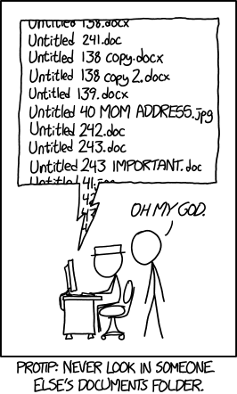</center>

<div style="text-align:center">
<P><SMALL>https://xkcd.com/1459. Shared under CC-BY-NC License</SMALL></P>
</div>

<div style="page-break-after: always;"></div>
****************

{{1}}
****************
> [!IMPORTANT] Measures in research data management serve to improve findability and traceability of research data and to avoid data loss with the aim of increasing the (person-independent) re-usability of research data.
>
>**The first person who wants to re-use your data is you**!
>
>- Establish a system and use it constantly! 
>
>- Any system is better than none!
>
>- Always think of your future self! Store, name and document your own data in such a way that you can find, understand and re-use it as easily as possible.

****************

## General rules

{{0-3}}
*****************

> [!CAUTION] Never touch raw data! Always keep your raw data unchanged in a separate folder.

---
********************************************************************************

{{1-3}}
********************************************************************************

- Try to find ‘speaking’ names for folders and files ➞ no ‘fantasy names’ 🦄, no random character strings

- Develop a standardised scheme and a logical structure

  - for both folder and file names.

  - Folders in hierarchical order with the most important first.

  - Limit yourself to a maximum of three folder levels.

  - Keep your personal preferences in mind during development, e.g. for ___sorting!___

********************************************************************************

{{2-3}}
********************************************************************************
- Follow [***ISO 8601***](https://en.wikipedia.org/wiki/ISO_8601) for dates and times

  - Date and time, e.g. YYYY-MM-DD-hh-mm-ss or YYYYMMDDhhmmss

********************************************************************************

{{3-4}}
********************************************************************************

- Always avoid spaces and all special characters (including special letters, such as german umlauts). ❌

  - The following characters in particular should **NOT** be used in folder or file names:

    - less than: `<` 

    - greater than: `>`

    - colon: `:`
    
    - double quotation mark: `“`
    
    - slash: `/`
    
    - backslash: ` \ `
    
    - vertical bar or pipe: `|`
    
    - question mark: `?`
    
    - asterisk: `*`

  - ✔️ The only unproblematic special characters in folder or file names are underscore `_` and hyphen/minus `-`

********************************************************************************

{{4-7}}
********************************************************************************

- Prefix consecutive numbers with a sufficient number of zeros (e.g. 001 for numbering from 1 to 100)

********************************************************************************

{{5-7}}
********************************************************************************

- When using file names for versioning
  
  - ❌❌ Do **NOT** use unspecific name components, such as **final**, **finished**, **new** or similar ❌❌

  - Try to use emantic versioning (Major-Minor-Patch), e.g.,

    - __0-1__ (a beta)

    - __1-0__ (a release version)

    - __1-1__ (a release version with slight correction)

  - define what you consider to be a "release" or a "slight correction"

- Document your versioning scheme

********************************************************************************

{{6-7}}
********************************************************************************

- Upper and lower case is considered different by some file systems, but not by others.  

********************************************************************************

{{7}}
********************************************************************************

- ***Document*** the naming conventions and abbreviations used!

  - Readme.md

**********************************************************

<div style="page-break-after: always;"></div>

## Examples

{{0-1}}
********************************************************************************

**Example for a folder hierarchy**

<center>
  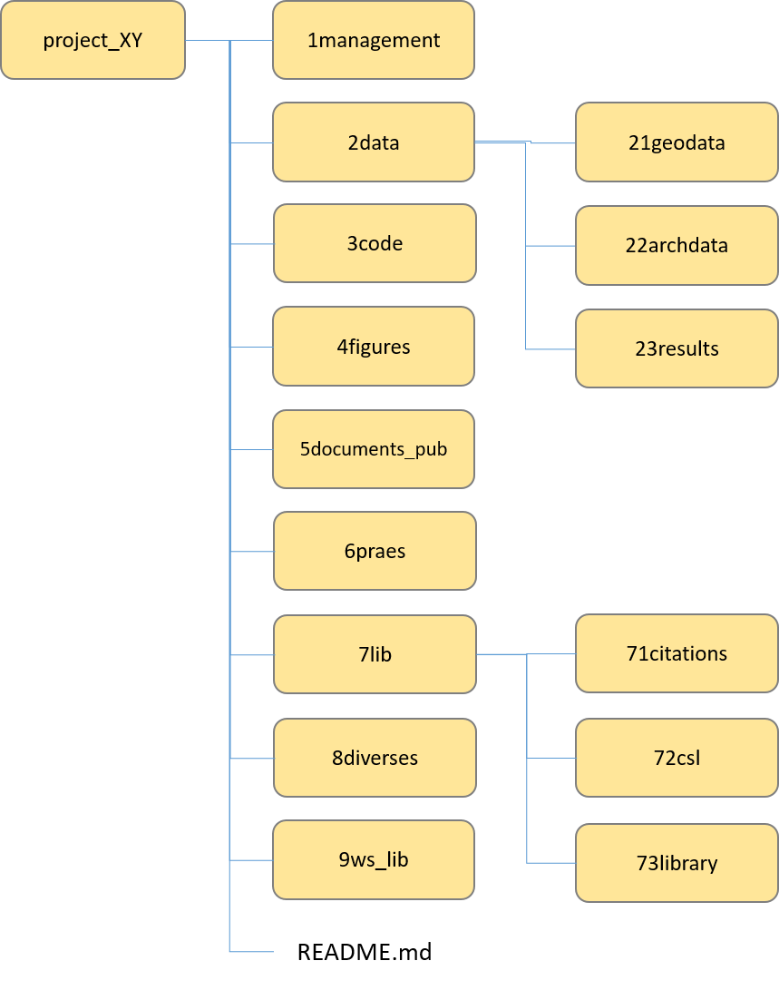
    <sub style="text-align: right;">Provided by Oliver Nakoinz</sub>
</center>

********************************************************************************

{{1-2}}
****************************************

>**Example for a file name following a naming convention**
>
>[Project name]\_[Approach]\_[Location]\_[Person-ID]_[Date].[Format-Suffix]
>
>Rebel-Hunting\_Interview\_DS-1-Orbital-Battle-Station\_Organa\_1976-05-25.mp4

****************************************

{{2}}
****************************************

>**Why [***ISO 8601***](https://en.wikipedia.org/wiki/ISO_8601) for dates and times?**
>
>>- **Kristall\_765\_spektr\_2016-12-03.csv**
>>- **Kristall\_765\_spektr\_16-12-03.csv**

****************************************

<div style="page-break-after: always;"></div>

## Your folder structure & naming conventions

>__Individual work or group work for people working on the same project__
><!--
style="width: 20%; max-width: 800px; float:right"
title="working"
onclick="alert('Individual work');"
-->
>
>What would be a good folder structure and a good file naming convention for the files related to your PhD project?
>
>Have a look at the following resource: Demerdash, Y., Dockhorn, R., & Wilbrandt, J. (2025). PhD Project Folder Template for the Life Sciences (Version v1.0) [Computer software]. Zenodo. https://doi.org/10.5281/zenodo.15835126
>
>- Download the resource, read README.md and have a look at the suggested folder structure.
>
>  - Where is the folder DMP?
>
>  - What do you think? Can it be adapted to your project? 
>
>- Download the [„File Naming Convention Worksheet“](https://doi.org/10.7907/894q-zr22) and fill it for one group of files.

<div style="page-break-after: always;"></div>

# Data documentation

{{0-1}}
*********

>**Group work**:
>
><!--
style="width: 20%; max-width: 800px; float:right"
title="group-work"
onclick="alert('Let´s work together!');"
-->
>
>You are working in a research group working on the ecology of forests. You receive some data from a previous co-worker: <A HREF="sources/average_d.xlsx" download>average_d.xlsx</A>
>
>* Speculate what kind of data it could be.
>
>Discuss and take notes.
>
>* Apart from the data itself, what information do you need to be able to work with a dataset?
>
>* What do you notice in regard of data quality?

*********

<div style="page-break-after: always;"></div>

{{1-2}}
*********

<div style="float:left; width:60%;">
  <p>

  **A good data documentation should include**

  - Information on the collection of data

      - Methods, units, time periods, locations, technique used, etc.

  - Structure of the data and their mutual relationships

  - Explanation of variables, labels and codes

  - Differences between different data set versions

  - Measures for data cleaning

  - Information on access and terms of use

      - Licensing

  - Ideal world

      - Description of the research undertaking

        - Goals

      - Hypotheses

</p>

</div>
***********

## Metadata

{{0}}
*********

<big>What is Metadata?</big>

*********

{{1}}
*********
 <!--
style="width: 20%; max-width: 800px; float:right"
-->

Metdata is...

- Data about data

- Administrative data

  - Information on the management of the data

  - Mostly generic

- Subject data

  - Individual aspects or data sets in more detail

  - Structured with respect to the research discipline

- Generic standards

  - [DataCite Metadata Schema](https://schema.datacite.org/)

  - [Dublin Core Metadata Initiative](https://dublincore.org/)

- Discipline-specific standards

  - [Metadata Standards Directory](https://rdamsc.bath.ac.uk/)

*******

<div style="page-break-after: always;"></div>

### Understanding Data

<div style="float:left; width:30%;">
  <p>

{{0-9}}
******************
> __Date:__ 364.07
***********

{{2-3}}
***********

<div style="width:40%;">
  
    <sub style="text-align: right;">The DOI® System ISO 26324</sub>
</div>

***********

{{3-4}}
******************

<div style="width:50%;">
  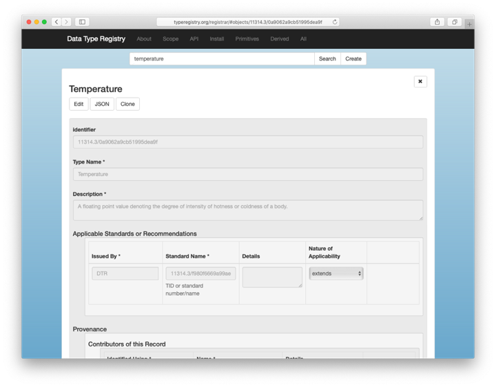
    <sub style="text-align: right;">Temperature in Kelvin 364,07 K ≈ 42,6º C</sub>
</div>

******************

{{4-5}}
*******************

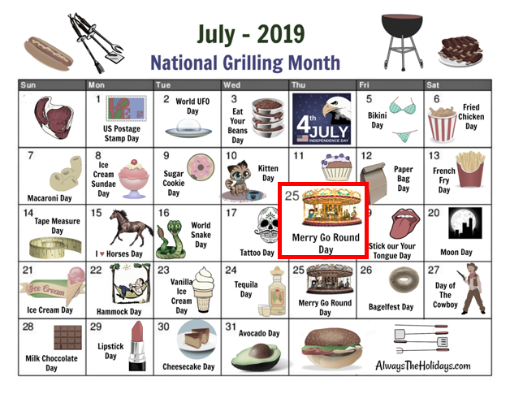

*******************

{{5-6}}
*******************

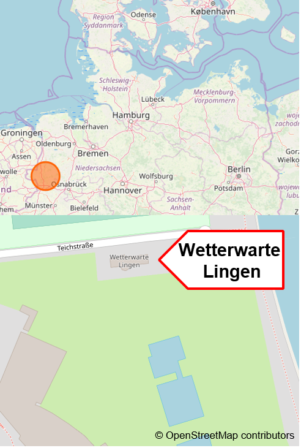

*******************

{{6-7}}
*************

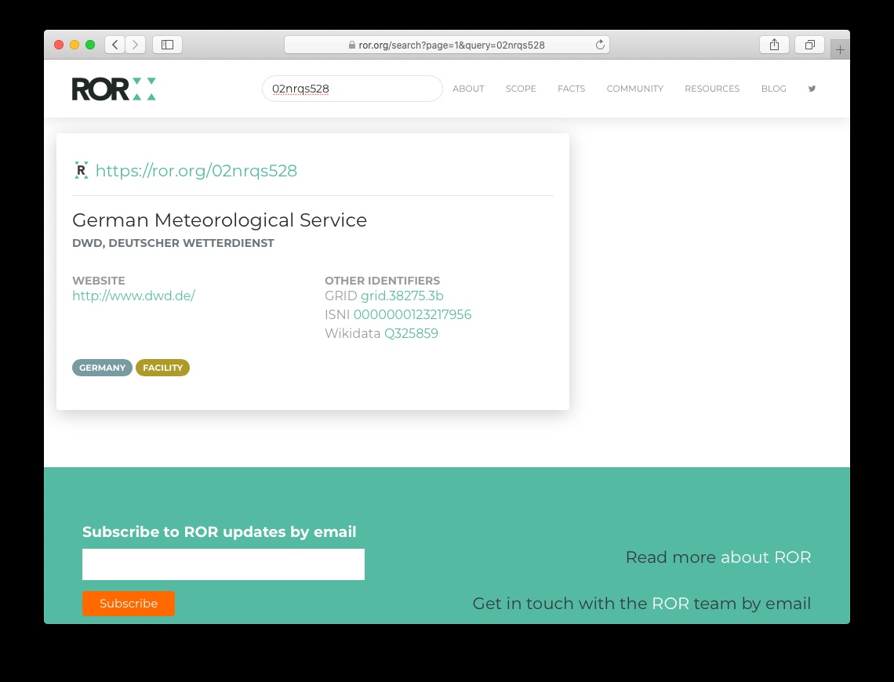

---


*******************

</p>

</div>

<div style="float:right; width:60%;">

{{1-2}}
***********
Data about Data

- Identifier: 10.1594/dwd-weather-data
- Identifier Type: DOI
- Unit: K
- Data Type Identifier: 11314.3/0a9062a9cb51995dea9f
- Date: 2019-07-25T15:00:00Z
- Location: 52.5178687 7.3057642
- Creator: Deutscher Wetterdienst
- ROR: 02nrqs528

***************

{{2-3}}
*************
Origin, Location and Meaning of Data

> - Identifier: 10.1594/dwd-weather-data
>
> - Identifier Type: DOI
- Unit: K
- Data Type Identifier: 11314.3/0a9062a9cb51995dea9f
- Date: 2019-07-25T15:00:00Z
- Location: 52.5178687 7.3057642
- Creator: Deutscher Wetterdienst
- ROR: 02nrqs528

************

{{3-4}}
******************
Origin, Location and Meaning of Data

- Identifier: 10.1594/dwd-weather-data
- Identifier Type: DOI
> - Unit: K
>
> - Data Type Identifier: 11314.3/0a9062a9cb51995dea9f
- Date: 2019-07-25T15:00:00Z
- Location: 52.5178687 7.3057642
- Creator: Deutscher Wetterdienst
- ROR: 02nrqs528

***************

{{4-5}}
*******************
Origin, Location and Meaning of Data

- Identifier: 10.1594/dwd-weather-data
- Identifier Type: DOI
- Unit: K
- Data Type Identifier: 11314.3/0a9062a9cb51995dea9f
>- Date: 2019-07-25T15:00:00Z
- Location: 52.5178687 7.3057642
- Creator: Deutscher Wetterdienst
- ROR: 02nrqs528

****************

{{5-6}}
**************
Origin, Location and Meaning of Data

- Identifier: 10.1594/dwd-weather-data
- Identifier Type: DOI
- Unit: K
- Data Type Identifier: 11314.3/0a9062a9cb51995dea9f
- Date: 2019-07-25T15:00:00Z
> - Location: 52.5178687 7.3057642
- Creator: Deutscher Wetterdienst
- ROR: 02nrqs528

**************

{{6-7}}
*************
Origin, Location and Meaning of Data

- Identifier: 10.1594/dwd-weather-data
- Identifier Type: DOI
- Unit: K
- Data Type Identifier: 11314.3/0a9062a9cb51995dea9f
- Date: 2019-07-25T15:00:00Z
- Location: 52.5178687 7.3057642
> - Creator: Deutscher Wetterdienst
>
> - ROR: 02nrqs528

***************************
{{7-8}}
*************
Origin, Location and Meaning of Data

- Identifier: 10.1594/dwd-weather-data
- Identifier Type: DOI
- Unit: K
- Data Type Identifier: 11314.3/0a9062a9cb51995dea9f
- Date: 2019-07-25T15:00:00Z
- Location: 52.5178687 7.3057642
- Creator: Deutscher Wetterdienst
- ROR: 02nrqs528
> - **Description**: Air temperature measurement at the weather station Lingen, Germany, on 29 July 2019 in Kelvin
**************

<div style="page-break-after: always;"></div>

{{8-9}}
*************
**Traceability**

<div style="width:100%;">
  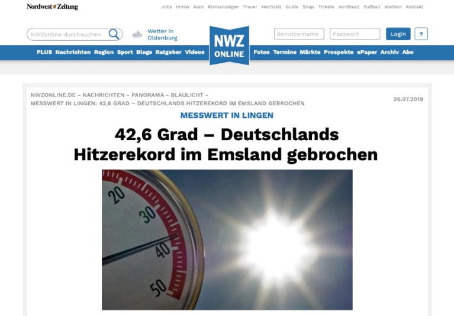
    <sub style="text-align: right;"></sub>
</div>


*****************

</div>

---

## README Templates

>**Individual work**:
>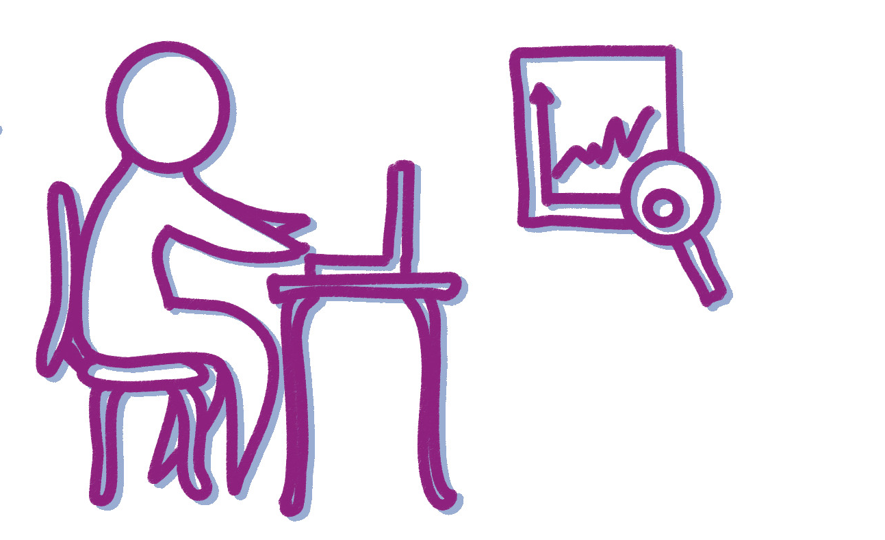 <!--
style="width: 20%; max-width: 800px; float:right"
title="working"
onclick="alert('Data documentation');"
-->
>
>Check our the following resources:
>
>Dockhorn, R., & Krause, M. (2024). "ReadMe" – or – "How to document your data?" (Version v1.0). Zenodo. https://doi.org/10.5281/zenodo.10648864
>
>Schröter, A., Fink, F., Golub-Overbeck, B., Hunold, J., Bonatto Minella, C., & Liermann, J. (2026). Chemistry-specific README template for data publications (Version 1.0). Zenodo. https://doi.org/10.5281/zenodo.21619429

<div style="page-break-after: always;"></div>

# File formats
{{0-1}}
*************
>**Group work**:
><!--
style="width: 20%; max-width: 800px; float:right"
title="puzzle"
onclick="alert('Let´s work together!');"
-->
>
>Let us collect all file formats you are working with.
>
>Post all file formats you are working with:
>
>https://answergarden.ch/3931685

*************

{{1}}
*************

<iframe src="https://answergarden.ch/3931685" style="border:0px;width:100%;height:500px" allowfullscreen="true" webkitallowfullscreen="true" mozallowfullscreen="true"></iframe>

*************
<div style="page-break-after: always;"></div>

## Choosing file formats

>-> Non-Proprietary, unencrypted, uncompressed and commonly used
>
>-> Open-standard-compliant, documented and royalty-free

| Data Type    | Recommended | Trade-off Matter | Not Recommented |
| ------------ | ----------- | ---------------- | --------------- |
| Tabular      | CSV, TSV, ODS| XLSX, SPSS portable| XLS, SPSS |
| Textual      |TXT, MD, HTML, ODT | DOCX, RTF, PDF/A | DOC, PDF, PS |
| Presentation | ODP, HTML   |  PPTX            |   PPT           |
| video        |MP4, MKV, OGG|  WEBM            | WMV, MOV, QT, Flash|
| Audio        | MP4, FLAC, WAV, OGG | MP3, AIF |                 |
| Image        | TIFF, PNG   |  BMP, JPG        |   PSD, GIF      |
| Vector       |  SVG        |                  |     AI          |
| Generic      |  XML, JSON, RDF |              |                 |
| Container    | Bagit, Frictionless, Data Package| ZIP, TAR |      |

<div style="page-break-after: always;"></div>

# Back up & long-term storage

{{0}}
Where do you store your data?
---

<div style="float:right; width:40%;">
  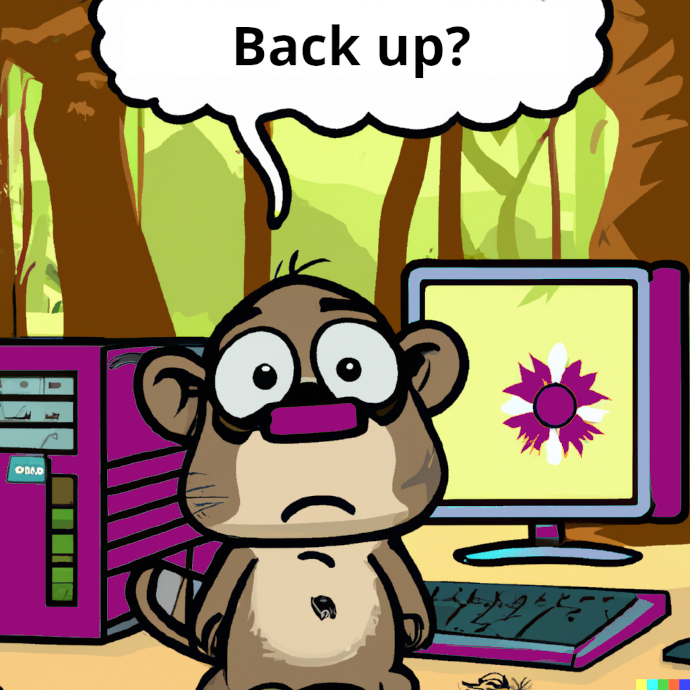
</div>


{{1}}
****************
> **Recommendations for your back up**
>
>- At least 3 copies of a file
>- On at least 2 different media
>- At least one of which is remote
>- Test data recovery at the beginning and at regular intervals.

****************

{{2}}
How do your store your (sensitive) data?
---

{{3}}
****************
> **Protect your (sensitive) data**:
>
>- Hardware (e.g. separate lockable room).
>- File encryption
>- Password security
>- At least two people should have access to your data

*****************

<div style="page-break-after: always;"></div>

## Back up vs. long-term storage

| Back up                                                                          | Long-term storage             |
| -------------------------------------------------------------------------------- | ----------------------------- |
| Automatic backup of all data   | Storage of only selected data |
| All versions                                                                     | Final version only            |
|   to prevent data loss <br>(technical, e.g. defective, <br>or human, e.g. accidentally deleted) | Integrity backup <br> (e. g. regular check for modified or damaged data, <br>file system consitency)      |
|                                                                                  | Long-term storage             |
|                                                                                  | Searchability                 |

<div style="page-break-after: always;"></div>

# Licenses
{{0-1}}
*******************
- Licenses regulate conditions of subsequent use of published data.
- Free licenses allow the use, redistribution and modification of copyrighted works

  - are usually available for free use and only need to be linked to
  - Prerequisite is that you are the copyright holder


Selection of the license depends on the type of data:

  - e.g. Creative Commons (CC) licenses for articles, monographs, images, etc.

  - Open-Database-License (ODbL) for DB or CC starting with version 4

  - General Public License (GNU) for software

- If no license is granted, the stricter copyright applies, as far as applicable to data

***********

<div style="page-break-after: always;"></div>

{{1-2}}
******************
> **CC-Licenses**

><div style="width:100%;">
  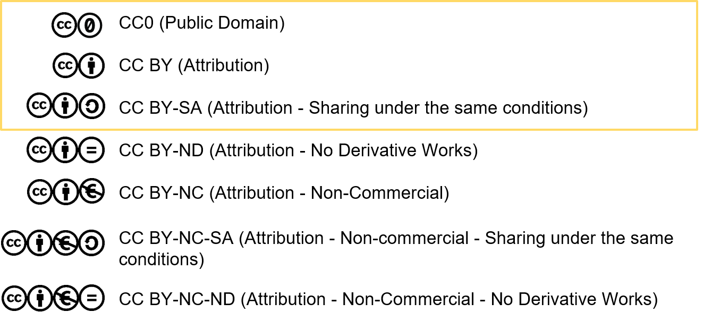
</div>


*********************

<div style="page-break-after: always;"></div>

{{2-3}}
******************
> **ODC-Licenses**

<div style="width:100%;">
  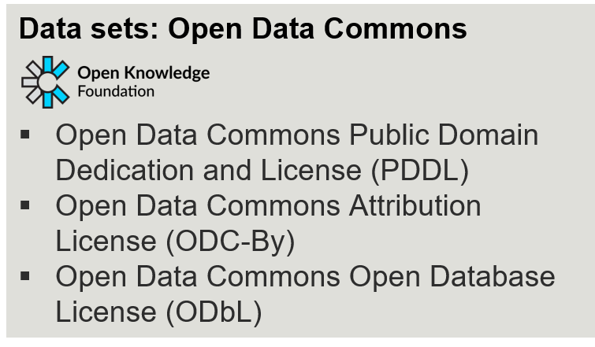
</div>

*********************

<div style="page-break-after: always;"></div>

{{3-4}}
************
**Take care!**

>$$
no\,license
\not =
free\,license
$$

********************

# Data publication

 How to publish and share your data?
----

{{1}}
********************
> Supplement to a peer-reviewed article ("enhanced publication")
********************

{{2-3}}
****************
- as a supplement to the associated article
- as a data set in a repository with a link to the corresponding article.

Example:

<div style="width:100%;">
  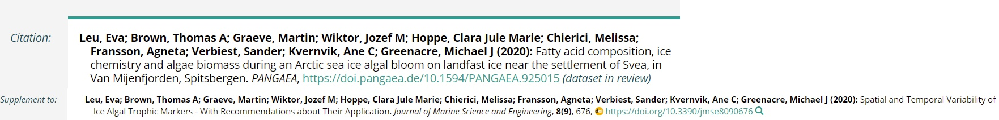
</div>

**********************

<div style="page-break-after: always;"></div>

{{1}}
********************
> Independent information object in a research data repository
********************

{{3-4}}
********************

* Discipline-specific repositories, e.g. [Datorium](https://data.gesis.org/sharing/#!Home), [Pangaea](https://www.pangaea.de/)

* cross-disciplinary repositories, e.g. [ZENODO](https://zenodo.org/)

* institutional repositories, e.g. [Refubium](https://www.fu-berlin.de/en/sites/open_access/refubium/index.html), [opendata@uni-kiel.de](https://opendata.uni-kiel.de/content/index.xml?lang=en)

Example:

<div style="float:left; width:45%;">
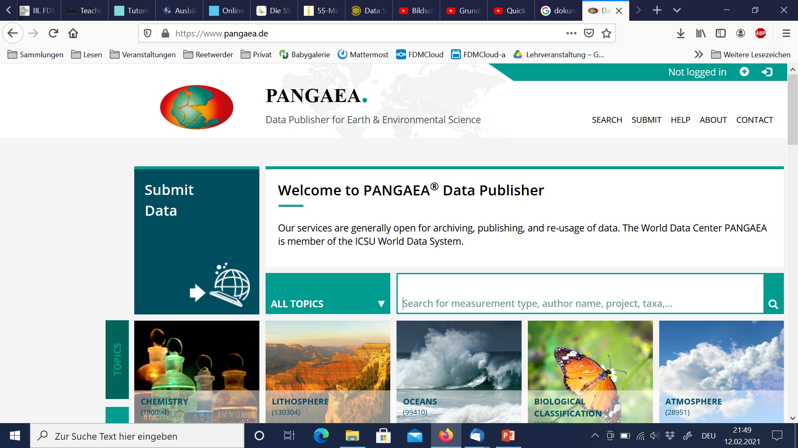
<sub>Source: https://www.pangaea.de/, Zugriff 10.02.2021</sub>

</div>

<div style="float:right; width:45%;">

<div style="width:100%;">
  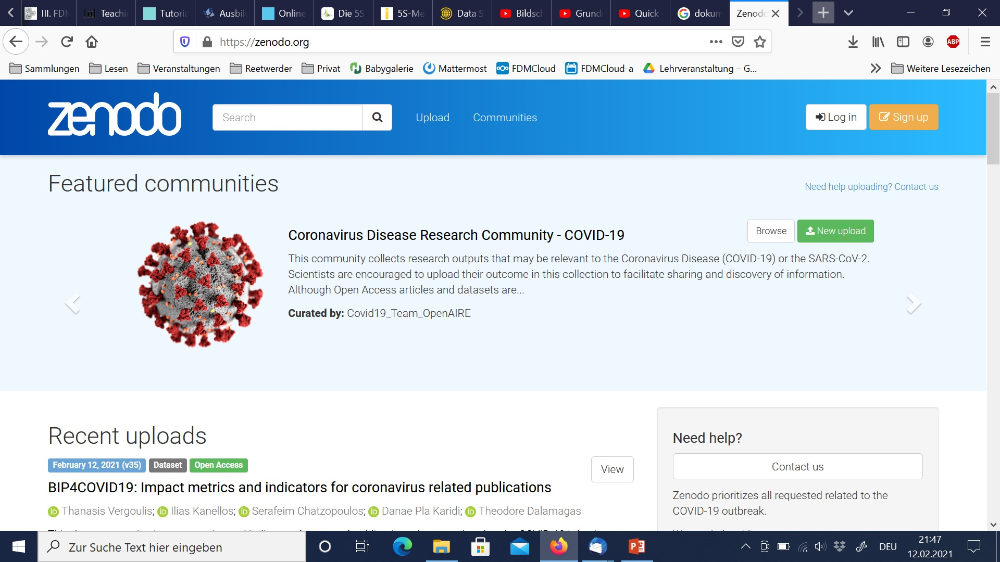
  <sub>Source: https://zenodo.org/, Zugriff 10.02.2021</sub>
</div>

</div>

*********************

<div style="page-break-after: always;"></div>

{{1}}
********************
> Data journals

********************

{{4-5}}
***************************

- publish detailed description of data

- partly peer-reviewed

Example:

<div style="float:left; width:45%;">
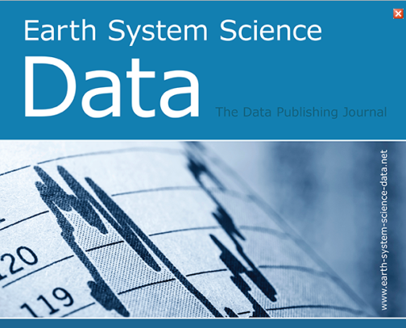
<sub>Source: https://www.earth-system-science-data.net, Zugriff 10.02.2021</sub>

</div>

<div style="float:right; width:45%;">

<div style="width:100%;">
  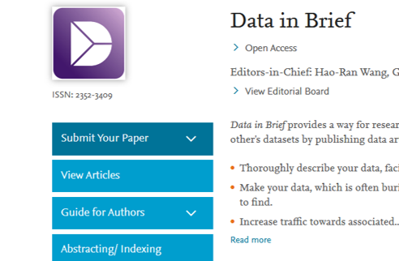
  <sub>Source: https://www.journals.elsevier.com/data-in-brief, Zugriff 10.02.2021</sub>
</div>

</div>

***************************

<div style="page-break-after: always;"></div>

## Repositories

{{0-2}}
***************************
**What is a repository?**

***************************

{{1-2}}
****************
>*"A repository (Latin repositorium, 'storehouse') is a managed place for storing ordered documents that are accessible to the public or to a restricted group of users. An archive (Latin archivum, file cabinet'), on the other hand, manages only historical documents.“*
>
>*"Digital research data repositories are information infrastructures that store and organize digital research data...as permanently as possible...to ensure the discoverability and accessibility of the data...“*

---

^Source: Esther Asef, Katarzyna Biernacka, Elisabeth Böker,Sarah Ann Danker, Juliane Jacob, Janna Neumann, Britta Petersen, Jessica Rex und Ute Trautwein-Bruns (2021): Data Sharing interaktiv vermitteln^

************************

<div style="page-break-after: always;"></div>

{{2-5}}
**How to find a repository**

{{3-4}}
***************

<div style="float:left; width:45%;">

[**re3data.org**](http://service.re3data.org)

- Collection of repositories
- Worldwide
- Various disciplines
- Researchers, funders, publishers and institutions

</div>

<div style="float:right; width:45%;">
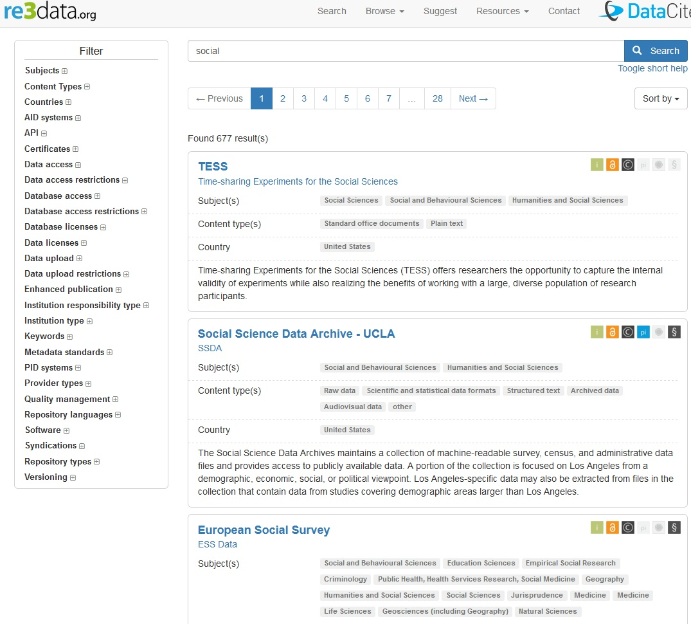
<sub>Source: re3data About. http://service.re3data.org/about. Zugriff 10.02.2021</sub>
</div>

***************


<div style="page-break-after: always;"></div>

{{4-5}}
*************

<div style="float:left; width:45%;">

[**risources.dfg.de**](http://risources.dfg.de/)

- Offer of the DFG
- Information portal
- Germany-wide
- Research Infrastructures
- For researchers

</div>

<div style="float:right; width:45%;">
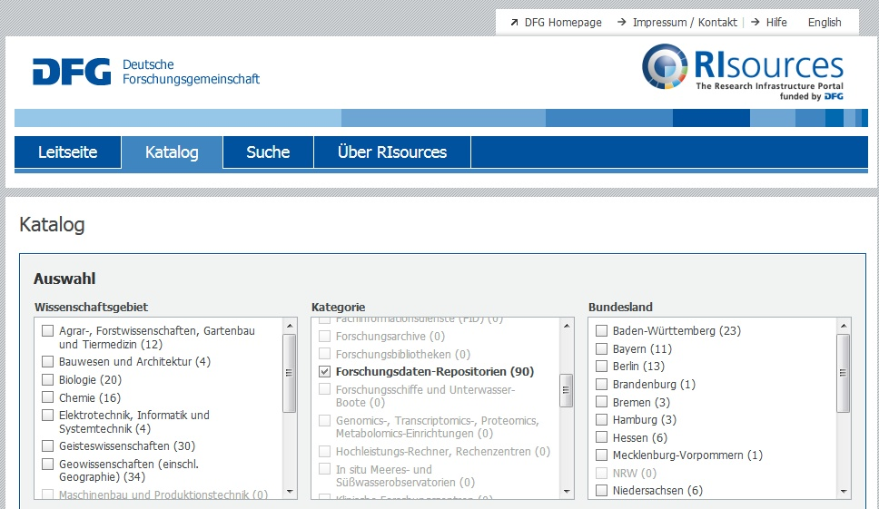
<sub>Source: http://risources.dfg.de/index.html#q=*&sort=RI_SORT_DE%20asc&rows=10&RI_EXT=Y. Zugriff 10.02.2021</sub>
</div>

************

<div style="page-break-after: always;"></div>

# Data management plan (DMP)

What is a data management plan?
---

> [!IMPORTANT] A DMP is a living document!

- All information that adequately describes and documents the collection, processing, storage, archiving, and publication of research data in the context of a research project.

- "[...] analysis of the workflow from the generation of the data to their use.“^1^


---

^[1] J. Ludwig, H. Enke (Hrsg.) Leitfaden zum Forschungsdaten-Management. Handreichungen aus dem WissGrid-Projekt. Verlag Werner Hülsbusch: Glückstadt, 2013.^

<div style="page-break-after: always;"></div>

## Components of a DMP

- Administrative information

  - Project name, data originator, other contributors, contact, funding program, etc.

- Project abstract

  - Data set descriptions
  - Data types, formats, scope
  - Metadata and standards information
  - Data sharing
  - Archiving and backup of data
  - Responsibilities
  - Legal and ethical aspects (e.g., licences, GDPR, Nagoya protocol, CARE)
  - Costs


<div style="page-break-after: always;"></div>

### Administrative Data

{{0}}
***********

**Identification data**

* name of the funding organization

* project grant number

* project title / acronym

* principal investigator / researcher

* researcher ID (e.g. ORCID)

* contact details for DMP responsible person

* date of first DMP version

* date of last update

***********

{{1}}
***********
**Relevant guidelines / policies**

* funder requirements

* subject-specific recommendations

* institutional guidelines

* project or institute specific policy on handling research data

***********

### Data description

**Type of research data**

* Which data types & formats are reused or generated?

* What tools or software tools will be used?

* Are existing data suitable for re-use in terms of choice of technology, formats, usage rights, licenses and metadata?

---

**Volume**

* Estimate the amount of data to be expected: during data analysis as well as after selection of data for permanent archiving.

* Of what size are the largest individual files?

### Data documentation & quality control

* folder and file naming conventions

* versioning

* metadata standards

* controlled vocabularies / ontologies

* supporting documentation

* virtual research environments / databases / ELAB journals


### Storage & Backup

* storage and data sharing during the project

* backup strategy

* access control according to protection requirements (e.g. GDPR)

* long-term storage according to GRP


### Legal aspects

* Data protection

* Copyright and rights of use

* Licensing law, patent law, etc.

>* **But**: currently **no legal advice** by Central Research Data Management! :-(

---

**Some helpful resources:**

* Checklist forschungsdaten.info (EN Version [Link](https://www.forschungsdaten.info/praxis-kompakt/english-pages/legal-issues/))

* UK Data Service Platform: Intro to legal aspects of RDM ([Link](https://www.ukdataservice.ac.uk/manage-data/legal-ethical))


### Data publication

* selection of datasets

* name of the (domain-specific) repository

* timeline of data transfer to the archive

* time of publication (embargo, if applicable)

* reason for restrictions

* selection of usage licenses


### Responsibilities & Ressources

**Who is responsible for RDM?**

* regulation of responsibilities

* access control

* training of project participants

* data curation / quality control

---

**Budget: Try to estimate: What does RDM cost?**

* e. g. data cleaning, storage fees, open access fees

### Guidelines & requirements

>[!IMPORTANT]Always know the guidelines and requirements of your funding organisation!

---

List of some guidelines and requirements
---

**Always check your project specific requirements!** 

**BMBF**: Individual Funding Criteria EC: [Aktionsplan FD](https://www.bmbf.de/de/aktionsplan-forschungsdaten-12553.html) german only

**EU - Horizon Europe**
[HE Programme Guide, S.40](https://ec.europa.eu/info/funding-tenders/opportunities/docs/2021-2027/horizon/guidance/programme-guide_horizon_en.pdf)

[EC: Open Research Europe. Data Guidelines](https://open-research-europe.ec.europa.eu/for-authors/data-guidelines)


DFG Guidelines
---

* [Guidelines for Safeguarding Good Research Practice. Code of Conduct.](http://doi.org/10.5281/zenodo.3923602)

* [Guidelines on the Handling of Research Data](https://www.dfg.de/en/research_funding/proposal_review_decision/applicants/research_data/index.html)

* [DFG Subject-Specific Recommendations (DFG-overview)](https://www.dfg.de/en/research_funding/proposal_review_decision/applicants/research_data/index.html#anker62237395)


International Guidelines
---

* [European Code of Conduct for Research Integrity](https://allea.org/wp-content/uploads/2023/06/European-Code-of-Conduct-Revised-Edition-2023.pdf)

* Research Integrity Statements
    
 * [Cape-Town Statement](https://www.wcrif.org/guidance/cape-town-statement)
 * [Singapore Statement](https://www.wcrif.org/statement)

### Guidelines @ Kiel University
{{0}}
***********
What about relevant guidelines at Kiel University?
---
***********

{{1}}
***********
**Kiel University:**

* [Guideline on the handling of research data](https://www.praesidium.uni-kiel.de/de/dokumente/leitlinie-zum-umgang-mit-forschungsdaten-guideline-on-research-data-management-english)

* [Guideline Good Scientific Practice](https://www.uni-kiel.de/fileadmin/user_upload/forschung/integritaet-ethik/downloads/cau-guidelines-good-scientific-practice.pdf)

* [Example for a project specific guideline: CRC 1461 Research Data Management Guide](https://www.tf.uni-kiel.de/crc1461rdm/)

**********

## DMP templates
{{0-1}}
***********
<div style="width: 20%; float:right">

</div>

So, how to start...? Use templates!
---

***********

{{1-2}}
***********
<div style="width: 20%; float:right">

</div>

DMP Templates Examples
---

* [CAU-template](https://www.datamanagement.uni-kiel.de/de/service/materialien)

* [DFG Checklist (for section 2.4 of the proposal)](https://www.dfg.de/download/pdf/foerderung/grundlagen_dfg_foerderung/forschungsdaten/forschungsdaten_checkliste_en.pdf)

* [Volkswagen Stiftung Basic DMP (rtf-File)](https://www.volkswagenstiftung.de/sites/default/files/documents/2022-04_basic_data_management_plan.rtf)

* [EU Horizon Europe-Template](https://fdm.uni-koeln.de/sites/FDM-UzK/Templates/data-management-plan-template_he_en-2.docx)

* [Science Europe Template](https://www.scienceeurope.org/our-priorities/research-data/research-data-management/)

---

Filled DMP Examples
---

* [DFG Sample (CMS / HU Berlin)](https://cms.hu-berlin.de/de/ueberblick/projekte/dataman/muster-dmp-dfg)

* [BMBF Sample (CMS / HU Berlin)](https://www.cms.hu-berlin.de/de/dl/dataman/muster-dmp-bmbf)

* [Zenodo published DMPs (uncurated list)](https://zenodo.org/search?q=DMP&f=subject:DMP&l=list&p=1&s=10&sort=bestmatch)

***********

{{2-3}}
***********

Templates based on the Research Data Lifecycle
---

* [DFG Checklist](https://www.dfg.de/download/pdf/foerderung/grundlagen_dfg_foerderung/forschungsdaten/forschungsdaten_checkliste_de.pdf)

* [Science Europe Template (engl.)](https://www.scienceeurope.org/our-priorities/research-data/research-data-management/)

---

Templates based on the FAIR-Principles
---

* [EU Horizon Europe-Template](https://fdm.uni-koeln.de/sites/FDM-UzK/Templates/data-management-plan-template_he_en-2.docx)

***********

## DMP tools

{{0}}
***********
**Generic DMP-Tools**

<div style="width: 20%; float:right">

</div>

[Research Data Management Organizer (RDMO) - DFG-funded](https://rdmorganiser.github.io/)

[DMPonline - Digital Curation Centre (DDC), hosted by University of Edinburgh](https://dmponline.dcc.ac.uk/)

[DMP Tool - California Digital Library](https://dmptool.org/)

***********

{{1}}
***********
**Subject-specific DMP tools**

* biodiversity and environmental research: [GFBio DMP-Tool](https://www.gfbio.org/plan)

* humanities & social sciences / language data: [CLARIN-D Wizard](https://www.clarin-d.net/de/aufbereiten/datenmanagementplan-entwickeln)

* geosciences: [MOSES DMP tool](https://moses-dmp.gfz-potsdam.de/) - prototype under development

* psychology: [DataWiz](https://datawiz.leibniz-psychology.org/DataWiz/)

* educational research: standardized DMPs ([STAMP](https://www.forschungsdaten-bildung.de/stamps-nutzen) soon available with RDMO tool or pdf file)
***********

## Sketching out your DMP

>__Individual work__
><!--
style="width: 20%; max-width: 800px; float:right"
title="working"
onclick="alert('Individual work');"
-->
>
>Download the CAU template for data management plans: [CAU\_DMP\_Template](sources\2026-06-02_diversilience-dmp-template.docx) <A HREF="sources\2026-06-02_diversilience-dmp-template.docx" download>DMP-Template</A>
>
>Have a look at the template and try to sketch out a DMP for your research project.
>
> * What information do you already have?
> * What information is missing to fill the template?

<div style="page-break-after: always;"></div>

# RDM related organisations & funder requirements

{{0-1}}
************

>**Research Data Alliance**

>**Nationale Forschungsdateninfrastruktur (NFDI)**

>**Deutsche Forschungsgemeinschaft (DFG)**

> **Horizon 2020 & Horizon Europe**

************

<div style="page-break-after: always;"></div>

{{1-2}}
************

>**Research Data Alliance**

************

{{1-2}}
************

<div style="float:left; width:60%;">

- International organisation founded in 2012

  - __Vision__: Researchers and innovators openly share data across technologies, disciplines, and countries to address the grand challenges of society

  - __Mission__: RDA builds the social and technical bridges that enable open sharing of data

- __Bottom-up__ development of practices, infrastructures, tools, technologies, services, approaches, policies, etc.
- __Practitioners__ come together in [Birds of a Feather-Groups (BoF)](https://www.rd-alliance.org/birds-of-a-feather/), [Interest Groups (IG)](https://www.rd-alliance.org/group-directory/?_group_type=interest-group) or [Working Groups (WG)](https://www.rd-alliance.org/group-directory/?_group_type=working-group)
- Regional chapters, e.g., [RDA Europe](https://www.rd-alliance.org/rda-europe) or [RDA Deutschland e.V.](https://www.rda-deutschland.de/)
- Strong __influence__ on European Commission, BMBF, DFG, …

</div>

<div style="float:right; width:30%">
  
</div>

*****************

<div style="page-break-after: always;"></div>


{{2-3}}
************

>**Nationale Forschungsdateninfrastruktur (NFDI)**

************

{{2-3}}
*****************

<div style="float:left; width:60%;">

- National research data management initiative in Germany
- Initiated by the [German Council for Scientific Information Infrastructures](http://www.rfii.de/en/home/)

- Horizontal linking of existing actors

  - Discipline-specific [NFDI consortia](https://www.nfdi.de/consortia/?lang=en) with with binding roadmaps

  - Bring into use existing infrastructure

  - Identify and fill gaps
- Interoperability of data and infrastructure

- Use of NFDI will probably get mandatory
- Participation in the work of NFDI consortia possible

</div>

<div style="float:right; width:30%">
  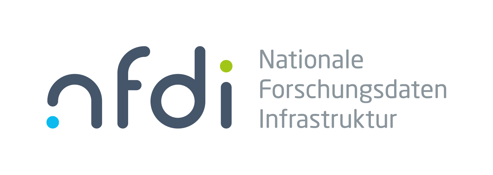
</div>

********************

<div style="page-break-after: always;"></div>

{{3-4}}
************

>**Deutsche Forschungsgemeinschaft (DFG)**

************

{{3-4}}
****************
<div style="float:left; width:60%;">

- Code of Conduct:
  [Guidelines for Safeguarding Good Research Practice](https://www.dfg.de/en/research_funding/principles_dfg_funding/good_scientific_practice/index.html)
- Guideline 7 – Quality assurance

  - Disclosing of origin of data, organisms, materials and software used
  - Reuse of data is clearly indicated; original sources are cited
  - Description of nature and scope of research data generated
  - Handling of research data in accordance with requirements of relevant subject area

- Guideline 13 – Public access

  - Making available research data where possible and reasonable

  - Making available software programmed by researchers with source code
- FAIR Principles

</div>

<div style="float:right; width:30%">
  
</div>

*****************

<div style="page-break-after: always;"></div>

{{4-5}}
************

> **Horizon 2020 & Horizon Europe**

************

{{4-5}}
*****************

<div style="float:left; width:60%;">

- Framework Programme for Research and Technological Development of the European Commission:

- [Horizon 2020 Online Manual – Data Management](https://ec.europa.eu/research/participants/docs/h2020-funding-guide/cross-cutting-issues/open-access-data-management/data-management_en.htm)

- [Horizon Europe – Programme Guide – Open Science](https://ec.europa.eu/info/funding-tenders/opportunities/docs/2021-2027/horizon/guidance/programme-guide_horizon_en.pdf#page=38)

- [Horizon Europe – Data Management Plan Template](https://ec.europa.eu/info/funding-tenders/opportunities/portal/screen/how-to-participate/reference-documents;programCode=HORIZON?programmePeriod=2021-2027&frameworkProgramme=43108390)

- Open access to research data is applicable by default

  - as open as possible, as closed as necessary

- Make research data findable, accessible, interoperable and re-usable (FAIR)

- DMP should include information on:

  - The handling of research data during & after the end of the project

  - What data will be collected, processed and/or generated

  - Which methodology & standards will be applied

  - Whether data will be shared/made open access and

  - How data will be curated & preserved (including after the end of the project)

</div>

  <div style="float:right; width:30%">
    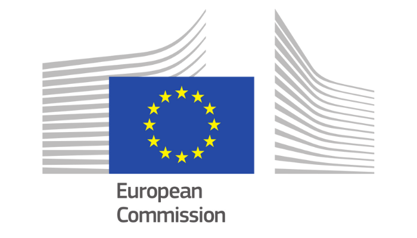
  </div>

******************

<div style="page-break-after: always;"></div>

# Take-Away Messages

>[!IMPORTANT] Practical Take-Away Messages

>1. <p style="color:#9a047f">**Document your data**</p>

{{1-2}}
************
>- Use documented naming and versioning conventions
>
>- document changes
>
>- think about metadata necessary to understand your data

*************

>2. <p style="color:#9a047f">**Formats**</p>

{{2-3}}
************
>  - __Generic and open standard file formats__ last longer than proprietary file formats
>
>    - Open Document Format (ODF)
>
>    - Comma separated values (CSV)
>
>    - Raw text files (TXT, MD)
>
>  - __Data container formats__ for __exchange, archival and publication__, e.g., [BagIt](https://tools.ietf.org/html/rfc8493), [Frictionless Data](https://frictionlessdata.io/)

*************

>3. <p style="color:#9a047f">**Storage**</p>

{{3-4}}
**********
>  - __Central infrastructure with backup__ for storage
>
>  - Desktop and laptop for work on current research data only
>
>  - Systematic file and folder naming and hierarchy
>
>  - Provide _Readme_ files
>
>  - Data Management Middleware for handling data and metadata, e.g., [iRODS](https://irods.org/)
>
>  - DFG [Guidelines for Safeguarding Good Research Practice](https://www.dfg.de/en/research_funding/principles_dfg_funding/good_scientific_practice/index.html)  require 10 years of preservation at least!

************

>4. <p style="color:#9a047f">**Publication**</p>

{{4-5}}
************
>  - Discipline-specific Repositories with specific metadata support
>
>    - [re3data: Registry of Research Repositories](https://www.re3data.org/)
>
>  - National or international initiatives
>
>    - NFDI (work in progress)
>
>    - [European Open Science Cloud Services](https://open-science-cloud.ec.europa.eu/)
>
>  - Institutional Data Repository: [opendata@uni-kiel](https://opendata.uni-kiel.de/content/index.xml?lang=en)
>
>  - Generic Repositories
>
>    - [Zenodo](https://zenodo.org/)

************

>5. <p style="color:#9a047f">**Licensing**</p>

{{5-6}}
**************
>  - [Creative Commons](https://creativecommons.org/): data with a necessary creation height; ideally CC0 or CC BY
>
>- [Open Data Commons](https://opendatacommons.org/): databases, raw data

**********

<div style="page-break-after: always;"></div>

# Questions

>**Nearly done!**
> <!--
style="width: 10%; max-width: 800px; float:right"
title="puzzle"
onclick="alert('Questions?');"
-->
>
>Time for questions!

<div style="page-break-after: always;"></div>

# One Minute Paper

>  __Individual work__
> <!--
style="width: 20%; max-width: 800px; float:right"
title="working"
onclick="alert('Individual work');"
-->
>
>Please take a piece of paper or create an own pad (e.g. https://zumpad.zum.de/).
>
>You have one minute.
>
>Please write down the most important points of our workshop today.

<div style="page-break-after: always;"></div>

# Feedback

>**Please give us some feedback!**
>
> You have a date with some friends tonight.
>
>Your friends remember that you attended a workshop on research data management today and ask: “Well, how was it”?
>
>What do you answer?
>
> | :-)  | :-/  | :-(  |

<div style="page-break-after: always;"></div>

# CAU contacts


<div style="float:right; width:40%">
  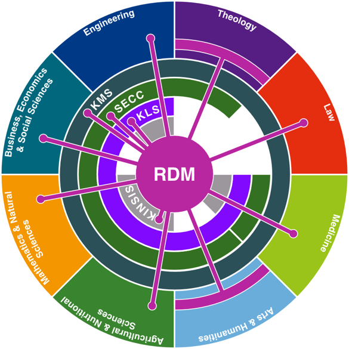
</div>

**RDM contacts at CAU**:

https://www.fdm.uni-kiel.de/en/team?set_language=en

<div style="page-break-after: always;"></div>

# Thank you! :-)

Please take care of your data! 🌼
---

# References

CASRAI Editorial Board. (2026, August 23). Types of research data: A taxonomy for data management planning. CASRAI. https://casrai.org/guides/types-of-research-data

Hassan, M. (2026, June 28). Research Data – Definition, Types, Examples and Best Practices. Research Method. https://researchmethod.net/research-data/

Wilbrandt, J. (2026, April 29). Data Organization Made Easy: Comprehensive Folder Structure Template for Early Career Life/Natural Science Researchers. Zenodo. https://doi.org/10.5281/zenodo.20119397

https://www.kuleuven.be/rdm/en/faq/faq-datatypes

